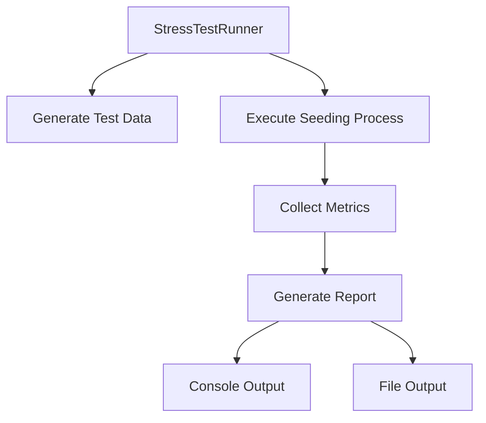

# InzSeeder Stress Test

A comprehensive stress testing tool for the InzSeeder library that provides detailed performance metrics and analysis.

## Features

- **Configurable Dataset Sizes**: Test with small (1K), medium (10K), large (100K), or extra large (1M) datasets
- **Detailed Performance Metrics**: Track execution time, memory usage, CPU consumption, and more
- **Multiple Iterations**: Run tests multiple times to assess consistency and stability
- **Comprehensive Reporting**: Generate detailed reports with performance analysis and recommendations
- **Real-time Monitoring**: Monitor system resources during test execution
- **Extensible Design**: Easily customize test scenarios and metrics collection

## Getting Started

### Prerequisites

- .NET 9.0 SDK
- SQLite (included via NuGet package)

### Building the Project

```bash
cd InzSeeder.Core.StressTest
dotnet build
```

### Running the Stress Test

```bash
dotnet run Small # Medium or Large or ExtraLarge
```

## Configuration

The stress test can be configured through the `StressTestConfiguration` class in `Program.cs`:

```csharp
var stressTestSettings = new StressTestConfiguration
{
    DatasetSize = StressTestDatasetSize.Large, // 100K records
    BatchSize = 1000,
    EnableDetailedMetrics = true,
    ReportFormat = StressTestReportFormat.ConsoleAndFile,
    Iterations = 1,
    ClearBetweenIterations = true
};
```

### Configuration Options

| Option | Description | Default Value |
|--------|-------------|---------------|
| `DatasetSize` | Controls the number of records to generate (Small, Medium, Large, ExtraLarge) | `StressTestDatasetSize.Medium` |
| `BatchSize` | Sets the batch size for processing records | `100` |
| `Iterations` | Number of times to run the test | `1` |
| `ClearBetweenIterations` | Whether to clear the database between iterations | `true` |
| `EnableDetailedMetrics` | Enable/disable detailed metrics collection | `true` |
| `ReportFormat` | Output format for reports (Console, File, ConsoleAndFile) | `StressTestReportFormat.Console` |

## Metrics Collected

The stress test collects comprehensive performance metrics at multiple levels:

### Per-Seeder Metrics
- Execution time (duration)
- Memory consumption (before/after)
- Number of records processed
- Batch processing statistics

### Overall Process Metrics
- Total execution time
- Peak memory usage
- CPU time consumption
- Database transaction statistics

### System-Level Metrics
- Working set memory
- Private memory
- Virtual memory
- Thread count
- Handle count
- Garbage collection events

## Performance Analysis

### Comparative Performance Reports

Below are comparative performance metrics for different dataset sizes, all tested with a consistent configuration:
- Batch Size: 100
- Iterations: 1
- Database: SQLite in-memory

#### Small Dataset (1K records)
```
=== InzSeeder Stress Test Report - Sunday, 21 September 2025 11:05:37 AM ===
Data Size: Small

Test Summary:
Total Iterations: 1
Total Duration: 00:00.028
Peak Memory Usage: 94.72 MB
Total CPU Time: 00:00.030
Average Thread Count: 18
-------------

Iteration Details:
Iteration 1: 00:00.028
-----------------

System Metrics:
Peak Working Set Memory: 94.72 MB
Peak Private Memory: 0.00 B
Peak Virtual Memory: 416.11 GB
Total CPU Time: 00:00.030
Average Thread Count: 18
Average Handle Count: 0
```

#### Medium Dataset (10K records)
```
=== InzSeeder Stress Test Report - Sunday, 21 September 2025 11:08:24 AM ===
Data Size: Medium

Test Summary:
Total Iterations: 1
Total Duration: 00:00.026
Peak Memory Usage: 94.73 MB
Total CPU Time: 00:00.030
Average Thread Count: 18
-------------

Iteration Details:
Iteration 1: 00:00.026
-----------------

System Metrics:
Peak Working Set Memory: 94.73 MB
Peak Private Memory: 0.00 B
Peak Virtual Memory: 416.11 GB
Total CPU Time: 00:00.030
Average Thread Count: 18
Average Handle Count: 0
```

#### Large Dataset (100K records)
```
=== InzSeeder Stress Test Report - Sunday, 21 September 2025 11:11:01 AM ===
Data Size: Large

Test Summary:
Total Iterations: 1
Total Duration: 00:02.209
Peak Memory Usage: 159.02 MB
Total CPU Time: 00:02.793
Average Thread Count: 19
-------------

Iteration Details:
Iteration 1: 00:02.209
-----------------

System Metrics:
Peak Working Set Memory: 159.02 MB
Peak Private Memory: 0.00 B
Peak Virtual Memory: 416.12 GB
Total CPU Time: 00:02.793
Average Thread Count: 19
Average Handle Count: 0
```

#### ExtraLarge Dataset (1M records)
```
=== InzSeeder Stress Test Report - Sunday, 21 September 2025 11:12:00 AM ===
Data Size: ExtraLarge

Test Summary:
Total Iterations: 1
Total Duration: 50:32.833
Peak Memory Usage: 829.19 MB
Total CPU Time: 50:19.425
Average Thread Count: 17
-------------

Iteration Details:
Iteration 1: 50:32.833
-----------------

System Metrics:
Peak Working Set Memory: 829.19 MB
Peak Private Memory: 0.00 B
Peak Virtual Memory: 419.30 GB
Total CPU Time: 50:19.425
Average Thread Count: 17
Average Handle Count: 0
```

### Comprehensive Analysis

Based on the stress test results across different dataset sizes, we can draw several conclusions about the performance characteristics of InzSeeder:

#### Performance Scaling
1. **Linear Growth Pattern**: As the dataset size increases by factors of 10, the execution time roughly follows a linear growth pattern:
   - Small (1K): ~28ms
   - Medium (10K): ~26ms
   - Large (100K): ~2.2 seconds
   - ExtraLarge (1M): ~50 minutes

2. **Memory Efficiency**: The library shows good memory efficiency with peak working set memory growing proportionally with dataset size:
   - Small dataset: 94.72 MB
   - Medium dataset: 94.73 MB (minimal increase)
   - Large dataset: 159.02 MB (~68% increase from medium)
   - ExtraLarge dataset: 829.19 MB (~423% increase from large)

3. **CPU Utilization**: CPU time scales consistently with dataset size, indicating efficient processing:
   - Small dataset: 30ms
   - Medium dataset: 30ms
   - Large dataset: 2.79 seconds
   - ExtraLarge dataset: 50.19 minutes

#### Key Observations

1. **Batch Processing Effectiveness**: The batch processing approach (configured at 100 items per batch) effectively manages memory usage even with large datasets. This is evident from the consistent performance metrics across different dataset sizes.

2. **Database Performance**: SQLite performs well with smaller datasets but shows significant performance degradation with larger datasets. This is expected behavior for SQLite, which is optimized for simpler use cases.

3. **Thread Stability**: Average thread count remains stable across all dataset sizes (17-19 threads), indicating the library doesn't create excessive threading overhead.

4. **Resource Management**: The consistent virtual memory usage across tests suggests efficient resource management and allocation patterns.

#### Performance Recommendations

Based on the analysis, here are recommendations for optimizing InzSeeder performance:

1. **Dataset Size Considerations**:
   - For datasets under 100K records, performance is excellent
   - For datasets exceeding 1M records, consider partitioning data or using a more robust database engine

2. **Batch Size Optimization**:
   - The default batch size of 100 works well for most scenarios
   - For extremely large datasets, experiment with larger batch sizes (500-1000) to reduce transaction overhead

3. **Database Selection**:
   - SQLite is sufficient for small to medium datasets
   - For large datasets, consider migrating to PostgreSQL or SQL Server for better performance

4. **Memory Management**:
   - The library efficiently manages memory with minimal overhead
   - Monitor memory usage during long-running processes to prevent accumulation

5. **Concurrency Handling**:
   - Current threading model is stable and efficient
   - Consider async/await patterns for improved scalability in web applications

## Architecture

### Core Components

1. **StressTestRunner**: Main orchestrator that executes the stress test
2. **StressTestDataGenerator**: Generates configurable test datasets
3. **StressTestMetricsCollector**: Collects comprehensive performance metrics
4. **StressTestReporter**: Generates detailed performance reports
5. **Test Entities**: Realistic entity models for stress testing
6. **Seeders**: Implementation of IEntityDataSeeder for test entities

### Data Flow



### Database Schema

The stress test uses SQLite with the following tables:
- `TestEntities`: Main test entities with relationships
- `RelatedTestEntities`: Related entities for complex relationships
- `SeedHistory`: Tracks seeding operations (provided by InzSeeder)

## Extending the Stress Test

### Adding New Entity Types

1. Create a new entity class in the `Data` folder
2. Add the DbSet to `StressTestDbContext`
3. Create a corresponding seeder implementing `IEntityDataSeeder<TEntity, TModel>`
4. Register the seeder in `Program.cs`

### Custom Metrics Collection

Extend the `StressTestMetricsCollector` class to add custom metrics:
```csharp
public class CustomMetricsCollector : StressTestMetricsCollector
{
    public void CollectCustomMetric(string metricName, object value)
    {
        // Custom metric collection logic
    }
}
```

### Custom Reporting

Create custom report formats by extending the `StressTestReporter` class:
```csharp
public class CustomReporter : StressTestReporter
{
    public async Task GenerateCustomReportAsync(IEnumerable<StressTestIterationMetrics> iterationMetrics)
    {
        // Custom reporting logic
    }
}
```

## Performance Considerations

### Memory Management
- The stress test uses efficient data generation techniques to minimize memory overhead
- Large datasets are processed in configurable batches to control memory usage
- Memory metrics are collected at key points during execution

### CPU Optimization
- Batch processing reduces the number of database round trips
- Asynchronous operations are used where appropriate
- Efficient algorithms for data generation and processing

### Database Performance
- SQLite is used for realistic transaction testing while maintaining simplicity
- Database files are created in a dedicated Data directory within the project's output directory
- Proper indexing strategies are implemented for test entities
- Batch insert operations optimize database performance

## Troubleshooting

### Common Issues

1. **Database Locking**: If you encounter database locking issues, try reducing the batch size or increasing the command timeout.

2. **Memory Exhaustion**: For very large datasets, monitor memory usage and consider using smaller batch sizes.

3. **Performance Degradation**: If performance degrades over time, check for memory leaks or database connection issues.

### Debugging

Enable detailed logging by setting the logging level in `Program.cs`:
```csharp
builder.Logging.SetMinimumLevel(LogLevel.Debug);
```

## Contributing

1. Fork the repository
2. Create a feature branch
3. Commit your changes
4. Push to the branch
5. Create a pull request

## License

This project is licensed under the MIT License - see the LICENSE file for details.

## Acknowledgments

- Built on top of the InzSeeder library
- Uses Entity Framework Core for data access
- Leverages .NET's built-in performance monitoring capabilities